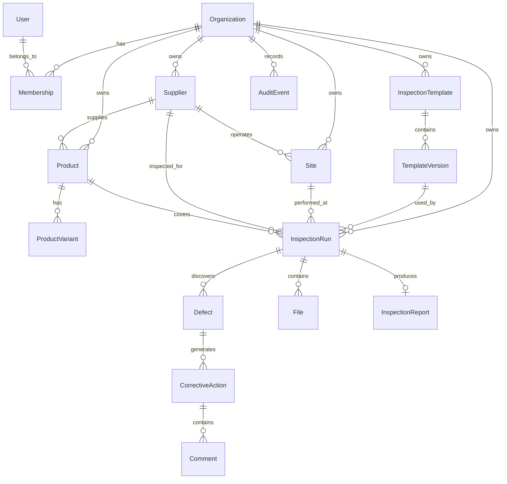

# Qualti.io Data Model

> Status: Draft  
> Scope: Core open-source platform and SaaS-compatible domain model  
> Primary database: PostgreSQL  
> ORM: Prisma  
> Architecture: Multi-tenant, API-first, modular monolith initially  
> Primary vertical: Furniture quality inspection

---

## 1. Purpose

This document defines the canonical data model for Qualti.io.

Qualti.io is a configurable quality inspection platform focused initially on furniture manufacturers, exporters, sourcing companies, suppliers, factories, and quality-control teams.

The model must support the complete lifecycle:

```text
Organization
    ↓
Supplier / Factory / Site
    ↓
Product / SKU
    ↓
Purchase Order / Inspection Request
    ↓
Inspection
    ↓
Template Version
    ↓
Responses + Measurements + Evidence
    ↓
Defects
    ↓
Inspection Result
    ↓
Report
    ↓
Corrective Action
    ↓
Audit Trail
```

The data model must support both:

1. the hosted Qualti.io SaaS;
2. companies self-hosting the open-source product.

The core domain must therefore not depend on Qualti.io-specific billing, infrastructure, or proprietary services.

---

# 2. Design Principles

## 2.1 Historical inspection data is immutable

An inspection is a historical business record.

If an inspection was performed using:

```text
Dining Chair Inspection Template v3
```

and the template later becomes:

```text
Dining Chair Inspection Template v4
```

the old inspection must continue to use v3.

Historical meaning must never silently change.

Therefore:

```text
Inspection
    → TemplateVersion
        → immutable after publication
```

Never:

```text
Inspection
    → current Template
```

---

## 2.2 Published template versions are immutable

Template lifecycle:

```text
Template
    ├── Version 1
    ├── Version 2
    ├── Version 3
    └── Version 4
```

A version can be:

```text
DRAFT
PUBLISHED
SUPERSEDED
ARCHIVED
```

Rules:

- Draft versions can be edited.
- Published versions cannot be modified.
- Editing a published template creates a new version.
- Inspections reference the exact template version used.
- Old versions remain available for historical rendering.

---

## 2.3 Tenant ownership must be explicit

Most business data belongs to an organization.

Tenant-owned records must contain:

```text
organizationId
```

Examples:

```text
Supplier
Site
Product
Template
InspectionRun
Defect
CorrectiveAction
File
AuditEvent
```

We should never rely only on indirect tenant relationships when tenant ownership can be represented explicitly.

This makes:

- authorization safer;
- database queries simpler;
- Row Level Security easier later;
- indexing easier;
- tenant exports easier;
- tenant deletion easier.

---

## 2.4 Core domain data is relational

Use PostgreSQL tables for entities with stable business meaning.

Examples:

```text
Organization
Supplier
Product
InspectionRun
Defect
CorrectiveAction
File
```

Do not put the entire application into JSON.

---

## 2.5 Configurable template structures use JSONB

Inspection templates are intentionally dynamic.

The structure of:

- sections;
- fields;
- validation;
- tolerances;
- evidence requirements;
- conditional rules;

can therefore be represented as versioned JSON.

Example:

```text
TemplateVersion.schema
```

stored as PostgreSQL:

```text
JSONB
```

The canonical schema definition lives in:

```text
packages/template-core
```

The database stores instances of that schema.

---

## 2.6 Business entities should have stable IDs

Database primary keys must not encode business meaning.

Use:

```text
UUID
```

or another globally unique identifier.

Do not make things such as:

```text
INS-2026-00001
```

the database primary key.

Instead:

```text
id: UUID
inspectionNumber: INS-2026-00001
```

This allows business-readable identifiers to change independently from internal identity.

---

# 3. High-Level Domain Model



This diagram is intentionally simplified.

The detailed model follows.

---

# 4. Identity and Tenancy

## 4.1 User

A `User` represents a human identity.

```text
User
-----
id
email
name
avatarUrl
status
createdAt
updatedAt
```

Suggested status:

```text
ACTIVE
INVITED
SUSPENDED
DISABLED
```

A user does not directly belong to only one organization.

A user may belong to multiple organizations through `Membership`.

---

## 4.2 Organization

An `Organization` is the primary tenant boundary.

Examples:

```text
ABC Furniture Exports Pvt Ltd
IKEA India
XYZ Inspection Agency
Acme Furniture Manufacturing
```

Model:

```text
Organization
------------
id
name
slug
status
settings
createdAt
updatedAt
```

Possible status:

```text
ACTIVE
SUSPENDED
ARCHIVED
```

`settings` may contain organization-level configurable settings that do not deserve dedicated columns yet.

For example:

```json
{
  "timezone": "Asia/Kolkata",
  "dateFormat": "DD/MM/YYYY",
  "measurementSystem": "metric"
}
```

Keep security-sensitive settings outside generic JSON.

---

## 4.3 Membership

Membership connects users and organizations.

```text
Membership
----------
id
organizationId
userId
role
status
createdAt
updatedAt
```

Initial roles:

```text
OWNER
ADMIN
QUALITY_MANAGER
INSPECTOR
REVIEWER
MEMBER
```

Do not build an extremely complex permission engine for the first MVP.

The architecture should, however, allow moving from:

```text
role enum
```

to:

```text
Role
Permission
RolePermission
MembershipRole
```

later.

---

# 5. Furniture Domain

The platform is configurable, but the first product experience is explicitly optimized for furniture inspection.

---

## 5.1 Supplier

A supplier represents a company supplying products to the organization's supply chain.

```text
Supplier
--------
id
organizationId

name
code

email
phone
website

addressLine1
addressLine2
city
state
postalCode
countryCode

status

metadata

createdAt
updatedAt
archivedAt
```

Example:

```text
Supplier:
Sharma Furniture Industries

Code:
SUP-001
```

Possible status:

```text
ACTIVE
INACTIVE
BLOCKED
ARCHIVED
```

---

## 5.2 Site

A `Site` represents a physical location.

Examples:

```text
Factory
Warehouse
Distribution Center
Showroom
Supplier Facility
Inspection Location
```

Model:

```text
Site
----
id
organizationId
supplierId?

name
code
type

addressLine1
addressLine2
city
state
postalCode
countryCode

latitude?
longitude?

timezone?

status

createdAt
updatedAt
archivedAt
```

Possible types:

```text
FACTORY
WAREHOUSE
DISTRIBUTION_CENTER
SHOWROOM
SUPPLIER_SITE
OTHER
```

A supplier may operate multiple sites.

---

# 6. Products

## 6.1 Product

A `Product` represents the logical furniture product being inspected.

Examples:

```text
Dining Chair
Office Desk
Three-Seater Sofa
Queen Size Bed
Wooden Cabinet
Coffee Table
```

Model:

```text
Product
-------
id
organizationId

supplierId?

name
code
category

description?

brand?
model?

status

metadata

createdAt
updatedAt
archivedAt
```

Example categories:

```text
CHAIR
TABLE
SOFA
BED
CABINET
WARDROBE
DESK
STOOL
OTHER
```

The category system should eventually become configurable.

Do not hard-code every furniture category permanently into the database schema.

---

## 6.2 ProductVariant

Furniture products often vary by:

- size;
- material;
- finish;
- colour;
- upholstery;
- dimensions;
- configuration.

Use:

```text
Product
   ↓
ProductVariant
```

Model:

```text
ProductVariant
--------------
id
organizationId
productId

sku
name?

attributes

status

createdAt
updatedAt
archivedAt
```

Example:

```json
{
  "color": "Walnut",
  "material": "Solid Sheesham Wood",
  "widthMm": 450,
  "heightMm": 900,
  "finish": "Matte"
}
```

`sku` should normally be unique inside the organization.

---

# 7. Product Specifications

Inspection requirements often depend on specifications independent of the inspection template itself.

For example:

```text
Seat height: 450 ± 5 mm
Moisture content: 8% to 12%
Leg length: 700 ± 3 mm
Maximum scratch size: 2 mm
```

Eventually Qualti.io should support reusable product specifications.

Model:

```text
ProductSpecification
--------------------
id
organizationId
productId
productVariantId?

name
version

specificationData

status

publishedAt?
createdAt
updatedAt
```

This is not required for the earliest MVP.

Initially, specifications can live inside template fields.

Later they should become first-class entities when customers need:

```text
Product Spec
      ↓
Inspection Template
      ↓
Inspection
```

This keeps product engineering information separate from inspection procedure.

---

# 8. Purchase Orders

Furniture quality inspections frequently happen against purchase orders or production orders.

`PurchaseOrder` should therefore exist as a business context object.

```text
PurchaseOrder
-------------
id
organizationId

supplierId?

orderNumber

status

orderedAt?
expectedDeliveryAt?

currency?
totalQuantity?

metadata

createdAt
updatedAt
archivedAt
```

Possible statuses:

```text
DRAFT
OPEN
IN_PRODUCTION
READY_FOR_INSPECTION
PARTIALLY_INSPECTED
INSPECTED
COMPLETED
CANCELLED
```

---

## 8.1 PurchaseOrderItem

```text
PurchaseOrderItem
-----------------
id
organizationId
purchaseOrderId

productId
productVariantId?

quantity

metadata

createdAt
updatedAt
```

Example:

```text
PO-2026-1032

100 × Dining Chair / Walnut
50 × Dining Chair / Natural Oak
25 × Dining Table / Walnut
```

---

# 9. Inspection Templates

The complete template architecture is documented in:

```text
docs/template-system.md
```

The data model here only defines persistence.

---

## 9.1 InspectionTemplate

An `InspectionTemplate` is the stable logical identity of a template.

Example:

```text
Wooden Dining Chair Final Inspection
```

Model:

```text
InspectionTemplate
------------------
id
organizationId

name
description?

category?

status

createdById

createdAt
updatedAt
archivedAt
```

Important:

The editable checklist definition should not live directly on this record.

The actual checklist lives on `TemplateVersion`.

---

## 9.2 TemplateVersion

```text
TemplateVersion
---------------
id
organizationId
templateId

versionNumber
schemaVersion

status

schema

createdById
createdAt

publishedById?
publishedAt?

supersededAt?
archivedAt?
```

Example:

```text
templateId:
tpl_chair_final

versionNumber:
3

schemaVersion:
1

status:
PUBLISHED
```

There are two different versions here.

### `versionNumber`

Represents business template evolution.

Example:

```text
Dining Chair Inspection

v1
v2
v3
```

### `schemaVersion`

Represents the Qualti.io template schema format.

Example:

```text
schemaVersion = 1
```

If Qualti.io later changes the structure of template JSON itself:

```text
schemaVersion = 2
```

This distinction is essential.

---

## 9.3 Template schema

Example simplified schema:

```json
{
  "schemaVersion": 1,
  "sections": [
    {
      "id": "sec_dimensions",
      "title": "Dimensions",
      "fields": [
        {
          "id": "seat_height",
          "type": "measurement",
          "label": "Seat height",
          "unit": "mm",
          "required": true,
          "acceptance": {
            "target": 450,
            "tolerance": 5
          }
        }
      ]
    }
  ]
}
```

Stable field IDs are critical.

Never use array index as field identity.

Bad:

```text
sections[0].fields[2]
```

Good:

```text
seat_height
```

Inspection responses reference these stable IDs.

---

# 10. Inspection Lifecycle

For the execution entity, use:

```text
InspectionRun
```

This prevents ambiguity between:

```text
inspection definition
```

and:

```text
actual performed inspection
```

---

## 10.1 InspectionRun

Model:

```text
InspectionRun
-------------
id
organizationId

inspectionNumber

templateVersionId

siteId?
supplierId?

purchaseOrderId?
purchaseOrderItemId?

productId?
productVariantId?

status
result

title?

scheduledAt?
startedAt?
submittedAt?
reviewedAt?
completedAt?

assignedInspectorId?
reviewedById?

responseData

summaryData?

templateSnapshot?

createdById

createdAt
updatedAt
archivedAt?
```

Possible lifecycle:

```text
DRAFT
    ↓
SCHEDULED
    ↓
ASSIGNED
    ↓
IN_PROGRESS
    ↓
SUBMITTED
    ↓
UNDER_REVIEW
    ↓
APPROVED
    ↓
COMPLETED
```

Alternative transitions:

```text
SUBMITTED
    ↓
REJECTED
    ↓
IN_PROGRESS
```

or:

```text
ANY_NON_FINAL_STATE
    ↓
CANCELLED
```

MVP may use a smaller subset.

For example:

```text
DRAFT
IN_PROGRESS
SUBMITTED
APPROVED
REJECTED
CANCELLED
```

Do not add states simply because they might theoretically be useful.

---

## 10.2 Inspection result

Workflow status and inspection result are different concepts.

Example:

```text
status = COMPLETED
result = FAILED
```

Possible result values:

```text
NOT_EVALUATED
PASSED
PASSED_WITH_OBSERVATIONS
FAILED
NOT_APPLICABLE
```

Future systems may support configurable result rules.

---

# 11. Inspection Context Snapshot

Inspections must remain historically understandable even if related data later changes.

Suppose:

```text
Supplier name:
ABC Furniture
```

later changes to:

```text
ABC Furniture Pvt Ltd
```

The inspection report should not unexpectedly change.

For historically important report data, store snapshots.

Example:

```json
{
  "supplier": {
    "id": "sup_123",
    "name": "ABC Furniture"
  },
  "product": {
    "id": "prd_123",
    "name": "Dining Chair",
    "sku": "CHAIR-WAL-001"
  },
  "site": {
    "id": "site_123",
    "name": "Manesar Factory"
  }
}
```

Do not duplicate everything.

Snapshot information when changing it later would alter the historical meaning of the inspection.

---

# 12. Inspection Responses

For the first implementation, inspection responses should use a hybrid model.

## Canonical response payload

Store the form/checklist responses as:

```text
InspectionRun.responseData JSONB
```

Example:

```json
{
  "seat_height": {
    "value": 452,
    "unit": "mm",
    "result": "PASS"
  },
  "finish_quality": {
    "value": "FAIL",
    "notes": "Visible scratch near front-right leg"
  },
  "packaging_photo": {
    "fileIds": [
      "file_123"
    ]
  }
}
```

Advantages:

- dynamic templates;
- easy snapshotting;
- easy offline synchronization;
- simple template rendering;
- no migration for every new field type;
- inspection remains tied to template schema.

---

## What should NOT live only inside response JSON

Business entities that need:

- workflows;
- permissions;
- search;
- assignments;
- comments;
- analytics;
- independent lifecycle;

should be relational.

Therefore:

```text
Defects          → table
Files            → table
CorrectiveAction → table
AuditEvent       → table
Reports          → table
```

not nested permanently inside `responseData`.

---

# 13. Measurements

Measurements can initially be stored inside `responseData`.

Example:

```json
{
  "fieldId": "seat_height",
  "value": 452,
  "unit": "mm",
  "evaluation": {
    "target": 450,
    "min": 445,
    "max": 455,
    "result": "PASS"
  }
}
```

If measurement analytics becomes important later, introduce:

```text
InspectionMeasurement
```

with:

```text
id
organizationId
inspectionRunId
fieldId

numericValue
unit

targetValue?
minValue?
maxValue?

result

createdAt
```

Do not create this table prematurely.

Add it when customers actually require cross-inspection measurement analytics.

---

# 14. Defects

A failed checkpoint is not necessarily the same thing as a defect.

Example:

```text
Checkpoint:
Measure seat height

Result:
FAIL
```

may lead to:

```text
Defect:
Seat height outside allowed tolerance
```

Defects deserve their own lifecycle.

---

## 14.1 Defect

```text
Defect
------
id
organizationId

inspectionRunId

fieldId?
sectionId?

productId?
productVariantId?

code?

title
description?

category?
severity

status

quantityAffected?

assignedToId?

dueAt?
resolvedAt?

createdById

createdAt
updatedAt
archivedAt?
```

Severity:

```text
MINOR
MAJOR
CRITICAL
```

This maps naturally to furniture QC workflows and future AQL functionality.

Status:

```text
OPEN
IN_REVIEW
ACTION_REQUIRED
RESOLVED
ACCEPTED
REJECTED
CLOSED
```

Keep the initial implementation smaller if necessary.

---

# 15. Defect Taxonomy

Different furniture companies may categorize defects differently.

Examples:

```text
Scratch
Crack
Dent
Colour mismatch
Dimension mismatch
Loose joint
Uneven finish
Fabric damage
Stitching defect
Packaging defect
Missing hardware
Moisture issue
Structural defect
```

Eventually use:

```text
DefectCategory
--------------
id
organizationId

name
code?
description?

defaultSeverity?

parentId?

status

createdAt
updatedAt
```

This allows nested taxonomies:

```text
Surface Defects
    ├── Scratch
    ├── Dent
    └── Colour Mismatch

Structural Defects
    ├── Crack
    ├── Loose Joint
    └── Instability
```

For the earliest MVP, category may be a simple string or enum.

---

# 16. Files and Evidence

Never store images or PDFs directly inside PostgreSQL.

Binary files go to object storage.

Examples:

```text
AWS S3
Cloudflare R2
MinIO
customer-provided S3-compatible storage
```

The database stores metadata only.

---

## 16.1 File

```text
File
----
id
organizationId

storageProvider
bucket?
storageKey

originalName
mimeType
sizeBytes

checksum?

uploadedById?

status

createdAt
deletedAt?
```

Possible status:

```text
PENDING
READY
FAILED
DELETED
```

Do not expose storage keys directly as permanent public URLs.

Use signed URLs or the appropriate storage abstraction.

---

## 16.2 File association

A file may belong to:

- inspection evidence;
- a response field;
- defect evidence;
- corrective-action evidence;
- product documents;
- generated reports.

Avoid adding columns like:

```text
inspectionId
defectId
correctiveActionId
reportId
productId
```

all directly to `File`.

Prefer an association model.

```text
FileLink
--------
id
organizationId

fileId

entityType
entityId

purpose

fieldId?

createdAt
```

Possible `purpose`:

```text
INSPECTION_EVIDENCE
FIELD_RESPONSE
DEFECT_EVIDENCE
CORRECTIVE_ACTION_EVIDENCE
REPORT
PRODUCT_DOCUMENT
OTHER
```

This keeps file infrastructure generic.

If strict foreign-key integrity becomes more important than polymorphism, this model can later be split into domain-specific association tables.

---

# 17. Corrective Actions

Finding problems is only half of quality management.

Customers need to track how problems are fixed.

---

## 17.1 CorrectiveAction

```text
CorrectiveAction
----------------
id
organizationId

defectId

title
description?

status
priority?

assignedToId?

dueAt?

resolutionNotes?

createdById
completedById?

createdAt
updatedAt
completedAt?
archivedAt?
```

Possible status:

```text
OPEN
IN_PROGRESS
AWAITING_EVIDENCE
AWAITING_REVIEW
COMPLETED
REJECTED
CLOSED
```

Corrective actions should eventually support supplier-side workflows.

---

# 18. Comments

Comments should be reusable across operational entities.

Initial model:

```text
Comment
-------
id
organizationId

entityType
entityId

body

createdById

createdAt
updatedAt?
deletedAt?
```

Potential entities:

```text
INSPECTION
DEFECT
CORRECTIVE_ACTION
```

Avoid comments inside arbitrary JSON blobs.

---

# 19. Inspection Reports

A report is generated from immutable or historical inspection data.

```text
InspectionReport
----------------
id
organizationId

inspectionRunId

version

status

summaryData

fileId?

generatedById?
generatedAt?

createdAt
```

Possible status:

```text
DRAFT
GENERATING
READY
FAILED
SUPERSEDED
```

Reports should be versioned when regenerated after an approved correction or addendum.

Do not silently overwrite the previous report.

Example:

```text
Inspection Report
    v1
    v2
```

---

# 20. Corrections and Addendums

Completed inspections should not normally be directly edited.

For historical integrity:

```text
Completed Inspection
        ↓
Correction / Addendum
```

Future model:

```text
InspectionRevision
------------------
id
organizationId

inspectionRunId

revisionNumber
reason

changes

createdById
approvedById?

createdAt
approvedAt?
```

This is preferable to silently replacing the original inspection response.

---

# 21. Audit Events

Auditability is a core architectural feature, not an afterthought.

Important actions should create append-only audit records.

---

## 21.1 AuditEvent

```text
AuditEvent
----------
id
organizationId

actorUserId?

action

entityType
entityId

metadata

previousValues?
newValues?

ipAddress?
userAgent?

createdAt
```

Examples:

```text
organization.created
membership.invited

template.created
template.version.created
template.version.published

inspection.created
inspection.started
inspection.response.updated
inspection.submitted
inspection.approved
inspection.rejected

defect.created
defect.updated
defect.resolved

corrective_action.created
corrective_action.completed

report.generated
```

Audit events are append-only.

Do not update old audit events.

---

# 22. Domain Events

Audit events and domain events serve different purposes.

### AuditEvent

Answers:

```text
Who did what and when?
```

### DomainEvent

Answers:

```text
What happened that other parts of the system should react to?
```

Example:

```text
inspection.submitted
```

could cause:

```text
Audit record
Notification
Report generation
Analytics update
Webhook delivery
AI summary
```

Future model:

```text
DomainEvent
-----------
id
organizationId

eventType

aggregateType
aggregateId

payload

occurredAt

publishedAt?
processingStatus?
```

Initially the modular monolith may emit events internally.

Later these events can feed queues or external event infrastructure.

---

# 23. Inspection Assignments

An inspection may eventually be assigned to:

- one inspector;
- multiple inspectors;
- a team;
- an external inspection agency.

For the initial MVP:

```text
InspectionRun.assignedInspectorId
```

is sufficient.

When multi-inspector workflows are required, introduce:

```text
InspectionAssignment
--------------------
id
organizationId

inspectionRunId
userId

role

assignedAt
completedAt?
```

Possible role:

```text
INSPECTOR
LEAD_INSPECTOR
REVIEWER
OBSERVER
```

Do not overbuild this before the product needs it.

---

# 24. Shipments and Lots

Furniture inspections frequently happen against production lots or shipments rather than individual products.

These entities are valuable but not required for the first product slice.

Future:

```text
Shipment
--------
id
organizationId

supplierId?
purchaseOrderId?

shipmentNumber

status

expectedAt?
shippedAt?
receivedAt?

metadata
```

and:

```text
InspectionLot
-------------
id
organizationId

inspectionRunId

lotNumber

totalQuantity
sampleQuantity
acceptedQuantity?
rejectedQuantity?

metadata
```

These become especially important when AQL sampling is introduced.

---

# 25. AQL Sampling

AQL should be a separate quality-domain concern rather than baked into the generic template engine.

Future models could include:

```text
SamplingPlan
------------
id
organizationId

name

standard
inspectionLevel
aqlMajor
aqlMinor
aqlCritical

configuration
```

An inspection can then snapshot the sampling decision:

```text
InspectionSampling
------------------
inspectionRunId

lotSize
sampleSize

minorAccept
minorReject

majorAccept
majorReject

criticalAccept
criticalReject
```

Do not implement full AQL during the earliest MVP unless customer discovery shows it is necessary.

---

# 26. API-First Integrations

Qualti.io should work both as:

```text
A complete SaaS application
```

and:

```text
An inspection platform integrated into a customer's existing systems.
```

A company may already have:

- ERP;
- procurement system;
- supplier management platform;
- warehouse software;
- custom internal software.

Qualti.io should not require replacing those systems.

---

## 26.1 External References

Core business entities should support external references without polluting every table with vendor-specific IDs.

Use:

```text
ExternalReference
-----------------
id
organizationId

provider

entityType
entityId

externalId

metadata

createdAt
updatedAt
```

Example:

```text
provider:
SAP

entityType:
PURCHASE_ORDER

entityId:
po_internal_123

externalId:
SAP-PO-99381
```

This is better than adding:

```text
sapId
oracleId
netsuiteId
customerErpId
```

to every domain table.

---

# 27. API Keys

API access belongs to the platform/security layer.

```text
ApiKey
------
id
organizationId

name

keyPrefix
keyHash

scopes

lastUsedAt?
expiresAt?

createdById

createdAt
revokedAt?
```

Never store plaintext API keys after creation.

Potential scopes:

```text
inspections:read
inspections:write

templates:read
templates:write

products:read
products:write

reports:read
```

---

# 28. Webhooks

Future integration model:

```text
WebhookEndpoint
---------------
id
organizationId

url

secretEncrypted

events

status

createdAt
updatedAt
```

and:

```text
WebhookDelivery
---------------
id
organizationId

webhookEndpointId
domainEventId?

eventType

payload

status

attemptCount
nextAttemptAt?

responseStatus?
responseBody?

createdAt
completedAt?
```

Delivery should happen asynchronously.

---

# 29. Offline Sync

The database model should not block a future offline-first mobile application.

Important client mutation properties:

```text
clientMutationId
clientUpdatedAt
```

Where appropriate, synchronization APIs should use idempotency.

Possible future model:

```text
ProcessedMutation
-----------------
id
organizationId

clientId
clientMutationId

entityType
entityId

processedAt
```

Unique:

```text
organizationId + clientId + clientMutationId
```

This prevents duplicate writes after network retries.

---

# 30. Notifications

Notifications are side effects of domain activity.

Future model:

```text
Notification
------------
id
organizationId

userId

type

title
body

entityType?
entityId?

readAt?

createdAt
```

Notification generation should be event-driven.

Example:

```text
inspection.assigned
        ↓
Notification
Email
Push notification
```

---

# 31. AI Data

AI features should not modify canonical inspection results silently.

AI provides suggestions.

Humans remain responsible for final quality decisions.

Future AI model:

```text
AIJob
-----
id
organizationId

type

entityType
entityId

provider
model

status

inputMetadata
output

promptVersion?

tokenUsage?
estimatedCost?

requestedById?

createdAt
startedAt?
completedAt?
```

Examples:

```text
REPORT_SUMMARY
DEFECT_CLASSIFICATION
CORRECTIVE_ACTION_SUGGESTION
TEMPLATE_GENERATION
SOP_SEARCH
```

AI output should remain traceable.

For example:

```text
AI suggestion:
MAJOR defect

Human result:
CRITICAL defect
```

Both should remain available for audit if AI materially influenced the workflow.

---

# 32. Documents and RAG

Knowledge-search functionality should remain separate from inspection templates.

Future model:

```text
Document
--------
id
organizationId

name
type

fileId

status

createdById

createdAt
updatedAt
```

and:

```text
DocumentChunk
-------------
id
organizationId

documentId

content
metadata

embedding
```

Potential documents:

```text
SOP
Quality manual
Product specification
Supplier manual
Work instruction
Furniture standard
Customer requirement
```

Templates may reference these documents but should not embed the entire knowledge base.

---

# 33. SaaS-Specific Models

The following belong to hosted Qualti.io and should not be required by the open-source inspection core:

```text
Subscription
Plan
Invoice
UsageRecord
Entitlement
BillingCustomer
```

The open-source domain must remain functional without them.

Example boundary:

```text
packages/template-core
packages/inspection-core
apps/api
apps/web
```

should not require:

```text
Stripe
Qualti billing
Qualti licensing server
```

to run basic inspections.

---

# 34. What Belongs in JSONB

Use JSONB intentionally.

Good candidates:

```text
TemplateVersion.schema

InspectionRun.responseData
InspectionRun.summaryData

ProductVariant.attributes

Organization.settings

ExternalReference.metadata

DomainEvent.payload

AuditEvent.previousValues
AuditEvent.newValues

AIJob.inputMetadata
AIJob.output
```

---

# 35. What Should Be Relational

Keep these relational:

```text
Organization
User
Membership

Supplier
Site

Product
ProductVariant

PurchaseOrder
PurchaseOrderItem

InspectionTemplate
TemplateVersion

InspectionRun

Defect
CorrectiveAction

File

InspectionReport

Comment

AuditEvent

ApiKey
WebhookEndpoint
```

Rule:

> If something has its own lifecycle, permissions, queries, workflows, analytics, or relationships, it probably deserves a table.

---

# 36. Deletion Policy

Business-critical historical records should normally not be physically deleted.

Use:

```text
archivedAt
```

or a domain-specific status.

Examples:

```text
Template        → archive
Product         → archive
Supplier        → archive
InspectionRun   → cancel / void
Report          → supersede
CorrectiveAction → close
```

Physical deletion should primarily be used for:

- temporary data;
- failed uploads;
- legally required data deletion;
- development/test data;
- records with no historical importance.

---

# 37. Inspection Immutability Rules

After:

```text
InspectionRun.status = APPROVED
```

the following should not be silently editable:

```text
templateVersionId
responses
inspection result
supplier snapshot
product snapshot
measurements
defect history
```

Changes must go through an explicit mechanism such as:

```text
revision
reopen
addendum
void + replacement
```

Every such action should create audit events.

---

# 38. Template Immutability Rules

After:

```text
TemplateVersion.status = PUBLISHED
```

these must be immutable:

```text
schema
schemaVersion
versionNumber
templateId
```

Editing creates:

```text
TemplateVersion N
       ↓
TemplateVersion N+1
```

Never:

```text
UPDATE published_template_version
SET schema = ...
```

---

# 39. Tenant Isolation Rules

Every query against tenant-owned data must include the organization boundary.

Conceptually:

```ts
where: {
  id,
  organizationId: currentOrganizationId
}
```

Never:

```ts
where: {
  id
}
```

for tenant-owned entities.

This should be reinforced through:

- repository/service boundaries;
- authorization middleware;
- integration tests;
- Prisma helpers where useful;
- PostgreSQL Row Level Security later.

---

# 40. Unique Constraints

Important examples:

```text
Membership
UNIQUE organizationId + userId
```

```text
TemplateVersion
UNIQUE templateId + versionNumber
```

```text
ProductVariant
UNIQUE organizationId + sku
```

```text
Supplier
UNIQUE organizationId + code
```

```text
Site
UNIQUE organizationId + code
```

```text
PurchaseOrder
UNIQUE organizationId + orderNumber
```

```text
InspectionRun
UNIQUE organizationId + inspectionNumber
```

External references:

```text
UNIQUE organizationId + provider + entityType + externalId
```

API keys:

```text
UNIQUE keyHash
```

---

# 41. Important Indexes

At minimum:

```text
InspectionRun:
organizationId + status
organizationId + createdAt
organizationId + siteId
organizationId + supplierId
organizationId + productId
organizationId + assignedInspectorId
```

```text
Defect:
organizationId + status
organizationId + severity
organizationId + inspectionRunId
organizationId + assignedToId
```

```text
CorrectiveAction:
organizationId + status
organizationId + dueAt
organizationId + assignedToId
```

```text
TemplateVersion:
templateId + versionNumber
templateId + status
```

```text
AuditEvent:
organizationId + createdAt
organizationId + entityType + entityId
```

```text
PurchaseOrder:
organizationId + orderNumber
organizationId + supplierId
```

Do not create speculative indexes for every possible query.

Use production query patterns and `EXPLAIN ANALYZE` before adding complex indexes.

---

# 42. Common Columns

Most tenant-owned entities should follow consistent conventions.

Example:

```text
id

organizationId

createdAt
updatedAt

createdById?
updatedById?

archivedAt?
```

Not every table needs every column.

Do not mechanically add fields that provide no business value.

---

# 43. Time Storage

Store timestamps in UTC.

Example:

```text
2026-08-16T17:30:00Z
```

Convert to organization/user timezone at the UI boundary.

Organization timezone may be:

```text
Asia/Kolkata
America/New_York
Europe/London
```

Do not store local timestamps without timezone context.

---

# 44. Units

Measurements are important for furniture inspection.

Avoid storing strings such as:

```text
"450 mm"
```

when the value must be calculated.

Prefer:

```json
{
  "value": 450,
  "unit": "mm"
}
```

Canonical units should eventually be defined by `template-core`.

Possible unit families:

```text
length
weight
temperature
humidity
percentage
angle
```

Conversion belongs to domain utilities, not arbitrary UI components.

---

# 45. Currency

If purchase-order financial values are introduced:

```text
amount
currency
```

Never assume INR.

Example:

```json
{
  "amount": 125000,
  "currency": "USD"
}
```

Prefer storing monetary values in a fixed precision numeric type or minor units according to the chosen financial convention.

---

# 46. Example Inspection

Consider:

```text
Organization:
Acme Furniture Imports

Supplier:
Sharma Furniture Industries

Site:
Sharma Factory, Jaipur

Product:
Oak Dining Chair

SKU:
CHAIR-OAK-001

PO:
PO-2026-00421

Template:
Dining Chair Final Quality Inspection

Template Version:
v3
```

The resulting relationship:

```text
Organization
    │
    ├── Supplier
    │       └── Site
    │
    ├── Product
    │       └── ProductVariant
    │
    ├── PurchaseOrder
    │       └── PurchaseOrderItem
    │
    └── InspectionRun
            │
            ├── TemplateVersion v3
            ├── Supplier
            ├── Site
            ├── ProductVariant
            ├── responseData
            │
            ├── Defect
            │       ├── Evidence
            │       └── CorrectiveAction
            │
            ├── InspectionReport
            │
            └── AuditEvents
```

---

# 47. Example Response

```json
{
  "visual_surface": {
    "value": "FAIL",
    "notes": "Scratch visible on left front leg",
    "fileIds": [
      "file_01"
    ]
  },

  "seat_height": {
    "value": 452,
    "unit": "mm",
    "result": "PASS"
  },

  "chair_stability": {
    "value": "PASS"
  },

  "packaging": {
    "value": "PASS",
    "fileIds": [
      "file_02",
      "file_03"
    ]
  }
}
```

The corresponding defect may be relational:

```text
Defect

title:
Scratch on left front leg

severity:
MAJOR

fieldId:
visual_surface

inspectionRunId:
inspection_123
```

This gives us both:

```text
flexible inspection data
```

and:

```text
queryable defect workflows
```

---

# 48. MVP Data Model

Do not implement every model described in this document immediately.

The first useful product slice needs approximately:

```text
User
Organization
Membership
Site

Supplier
Product
ProductVariant

InspectionTemplate
TemplateVersion

InspectionRun

Defect

File
FileLink

InspectionReport

AuditEvent
```

Potentially:

```text
PurchaseOrder
PurchaseOrderItem
```

if furniture discovery shows PO-driven inspections are required immediately.

This is enough for the first complete workflow:

```text
Create template
      ↓
Publish template
      ↓
Create inspection
      ↓
Choose supplier/product/site
      ↓
Perform inspection
      ↓
Record measurements
      ↓
Capture evidence
      ↓
Create defects
      ↓
Submit
      ↓
Review
      ↓
Generate report
      ↓
Preserve audit history
```

---

# 49. V1 Additions

After the inspection vertical slice works:

```text
PurchaseOrder
PurchaseOrderItem

CorrectiveAction
Comment

DefectCategory

InspectionAssignment

Notification

ApiKey
ExternalReference

WebhookEndpoint
WebhookDelivery

DomainEvent
```

---

# 50. Later Additions

Build only after product validation:

```text
Shipment
InspectionLot

SamplingPlan
InspectionSampling

ProductSpecification

InspectionRevision

SupplierPortalMembership

CustomRole
Permission

WorkflowDefinition
WorkflowVersion

AIJob

Document
DocumentChunk

OfflineSyncMutation

AnalyticsProjection
```

---

# 51. Things We Intentionally Do Not Model Yet

Avoid premature complexity.

Do not build now:

```text
Generic Entity system
Generic database table builder
Fully user-defined SQL schema
Microservice-owned databases
Event sourcing for every entity
Custom workflow DSL
Universal plugin database
Separate database per tenant
Data warehouse
Complex CQRS
Full AQL engine
AI-generated automatic acceptance decisions
```

These may become appropriate later.

They should not delay the core inspection workflow.

---

# 52. Important Domain Invariants

These rules should eventually have automated tests.

## Template invariants

```text
A published TemplateVersion cannot be modified.

A TemplateVersion belongs to exactly one InspectionTemplate.

versionNumber is unique per template.

An inspection may only start from a valid template version.

Historical inspections retain their template version.
```

## Inspection invariants

```text
An InspectionRun belongs to exactly one organization.

InspectionRun.organizationId must match Template.organizationId.

An approved inspection cannot silently change responses.

A submitted inspection must pass runtime validation.

Inspection responses reference field IDs that existed in the selected TemplateVersion.
```

## Tenant invariants

```text
Users cannot access tenant-owned data through another organization's membership.

Cross-tenant entity relationships are forbidden.

Files cannot be linked across organizations.

Defects cannot reference inspections from another organization.
```

## Audit invariants

```text
Audit events are append-only.

Important state transitions create audit events.

The actor and organization should be recoverable for security-sensitive operations.
```

---

# 53. Transaction Boundaries

Operations involving multiple important writes should use database transactions.

Example:

```text
Submit inspection

1. Validate inspection
2. Calculate result
3. Update InspectionRun
4. Create defects if explicitly required by business rules
5. Write AuditEvent
6. Persist DomainEvent / outbox event
```

Critical state should commit atomically.

Side effects should happen after transaction success.

Do not send email or call an AI API inside a database transaction.

Instead:

```text
Database transaction
       ↓
DomainEvent
       ↓
Queue
       ↓
Email / AI / Webhook / PDF worker
```

---

# 54. Outbox Pattern

When asynchronous processing becomes important, use an outbox-style model.

```text
OutboxEvent
-----------
id
organizationId

eventType
aggregateType
aggregateId

payload

createdAt
processedAt?
attemptCount
```

The application transaction writes:

```text
InspectionRun
AuditEvent
OutboxEvent
```

together.

A worker later publishes/processes the event.

This avoids the classic failure:

```text
DB committed successfully
but
event publishing failed
```

---

# 55. Prisma Modeling Guidelines

Prisma models should mirror domain concepts rather than UI screens.

Good:

```text
InspectionTemplate
TemplateVersion
InspectionRun
Defect
CorrectiveAction
```

Bad:

```text
TemplateBuilderPageData
InspectionDashboardRow
InspectionFormState
```

UI-specific representations belong in frontend/application DTOs.

---

# 56. Database Naming

Prisma:

```text
organizationId
createdAt
templateVersionId
```

PostgreSQL may use:

```text
organization_id
created_at
template_version_id
```

through Prisma mapping if desired.

Pick one database convention early and remain consistent.

---

# 57. API Serialization

Database objects are not automatically API contracts.

Do not expose Prisma objects directly everywhere.

Use API/domain DTOs.

Example:

```text
Database:
InspectionRun

API:
InspectionRunResponse
```

This lets the database evolve without unintentionally breaking API consumers.

This becomes particularly important because Qualti.io is intended to be API-first.

---

# 58. Data Model vs Template Model

Keep this distinction clear.

### Data model

Defines business entities:

```text
Supplier
Product
InspectionRun
Defect
```

### Template model

Defines configurable inspection questions:

```text
Section
Field
Measurement
Acceptance Criteria
Evidence Requirement
```

Do not turn every template field into a database column.

Do not turn every business entity into template JSON.

The two systems solve different problems.

---

# 59. Data Model vs Workflow Model

Likewise:

```text
InspectionRun.status
```

is enough for the first workflow.

A generic configurable workflow engine should be introduced only when customers require materially different processes.

Future architecture:

```text
WorkflowDefinition
WorkflowVersion
WorkflowState
WorkflowTransition
WorkflowInstance
```

The inspection data model should not require this engine in the MVP.

---

# 60. Final Model

The conceptual architecture should remain:

```text
                         ┌─────────────────┐
                         │  Organization   │
                         └────────┬────────┘
                                  │
                ┌─────────────────┼─────────────────┐
                │                 │                 │
                ▼                 ▼                 ▼
           Suppliers           Products          Sites
                │                 │
                │                 ▼
                │          ProductVariants
                │
                └─────────────────┬─────────────────┐
                                  │
                                  ▼
                          Purchase Orders
                                  │
                                  ▼
                      ┌─────────────────────┐
                      │   InspectionRun     │
                      └─────────┬───────────┘
                                │
              ┌─────────────────┼──────────────────┐
              │                 │                  │
              ▼                 ▼                  ▼
       TemplateVersion      responseData        Defects
              │                                   │
              │                                   ▼
              │                          CorrectiveActions
              │
              ├─────────────┐
              │             │
              ▼             ▼
            Files      InspectionReport
              │
              └─────────────┬───────────────┐
                            │               │
                            ▼               ▼
                       AuditEvents      DomainEvents
```

The most important architectural rule is:

> Qualti.io should make configurable inspection data flexible without making the entire business domain generic.

Stable business concepts remain relational.

Dynamic checklist definitions and responses remain schema-driven.

Historical records remain immutable and auditable.

That balance gives Qualti.io the flexibility of an inspection platform without turning the database into an unmaintainable generic form-storage system.